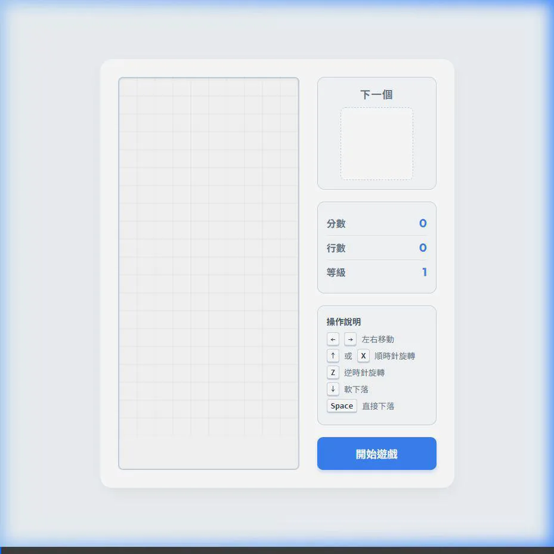

# 俄羅斯方塊開發完成

專案已根據您的要求實作完畢，並採用了清新的淺色主題。所有程式碼皆已寫入您的工作目錄 (`c:\Users\administrtor\Desktop\55555`) 中。

## 變更摘要

建立三個主要檔案，完全透過純前端技術實現。
- **[NEW] [`index.html`](./index.html)**: 建立遊戲主體結構，包含左側的遊戲畫布，以及右側包含「下一個方塊預覽」、分數、等級及控制說明的面板。
- **[NEW] [`style.css`](./style.css)**: 實作清新明亮的淺色主題，採用陰影和圓角設計，讓遊戲介面看起來具備現代感與立體感。
- **[NEW] [`script.js`](./script.js)**: 實作了完整的遊戲邏輯與音效。

## 重點功能展示

> [!TIP]
> **無外部資源依賴的音效**：使用 JavaScript 的 `Web Audio API` 動態合成了復古風格音效。這樣一來，不需下載任何 `.mp3` 或 `.wav` 檔案即可在網頁發出移動、旋轉、下落、消除及 Game Over 等多種音效。

### 支援的按鍵控制
- <kbd>←</kbd> <kbd>→</kbd>：左右移動
- <kbd>↑</kbd> 或 <kbd>X</kbd>：順時針旋轉
- <kbd>Z</kbd>：逆時針旋轉
- <kbd>↓</kbd>：軟下落 (加速下落)
- <kbd>Space</kbd>：硬下落 (瞬間著陸)

### 遊戲機制
1. **方塊多樣化**：實作 7 種標準 Tetromino 形狀並配有獨特的明亮色彩。
2. **預覽功能**：在介面右上角可以看見下一個即將出現的方塊。
3. **消除與計分**：填滿一橫排即可消除，一次消除多排可獲得更高分數。累積消除達一定行數後會提升等級並加快下落速度。

## 驗證方式
請使用瀏覽器直接開啟目錄下的 `index.html` 檔案。點擊畫面上的 **「開始遊戲」** 按鈕後，您就可以享受遊戲並聆聽按鍵觸發的動態音效了。

## 實際遊玩展示

